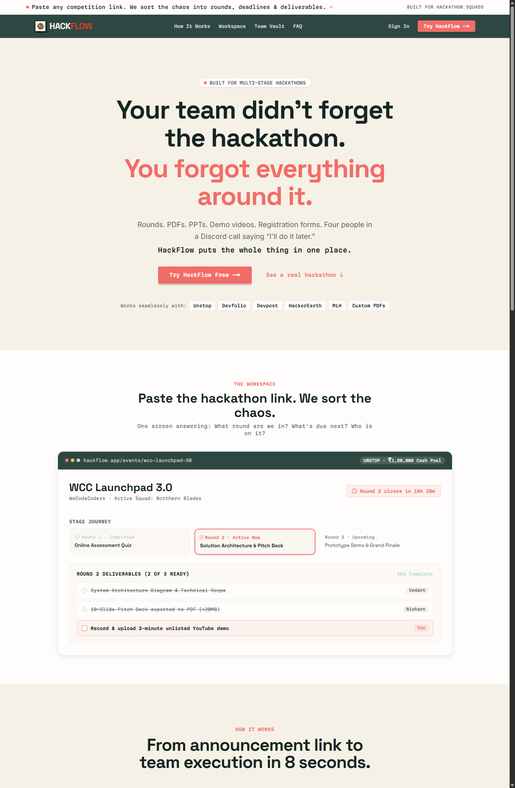
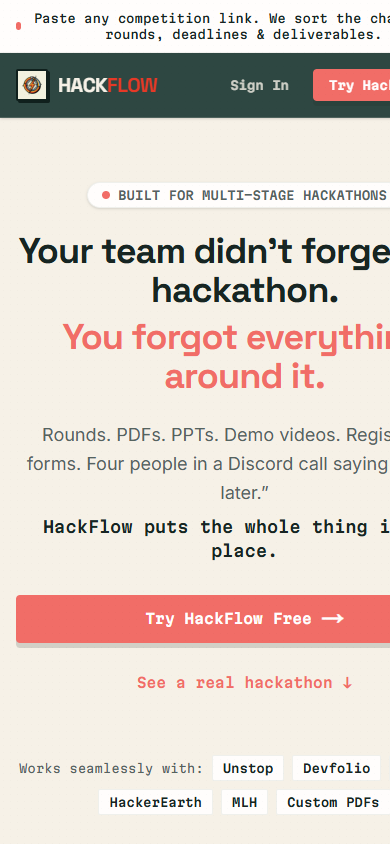
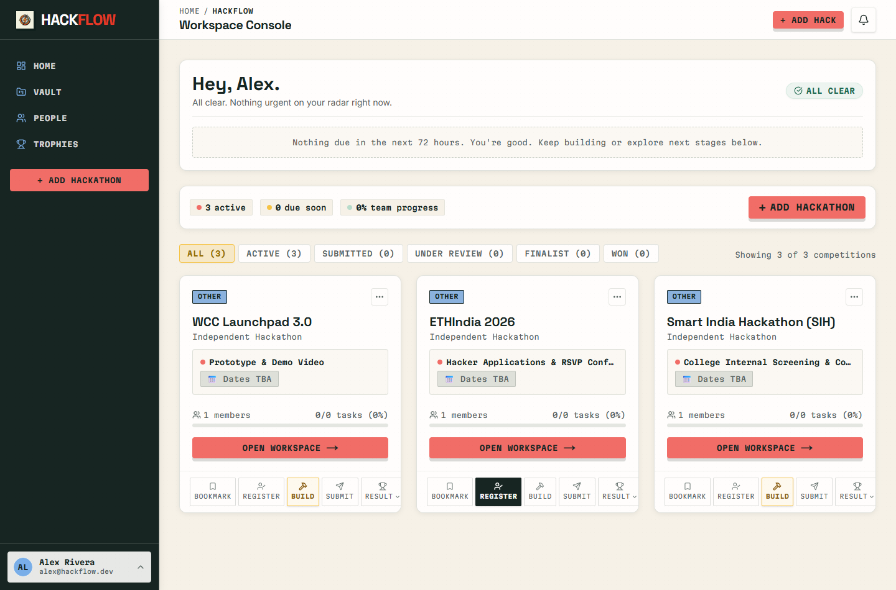
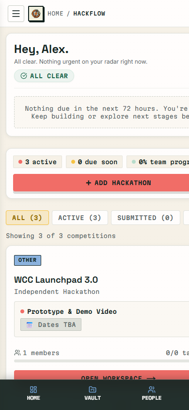
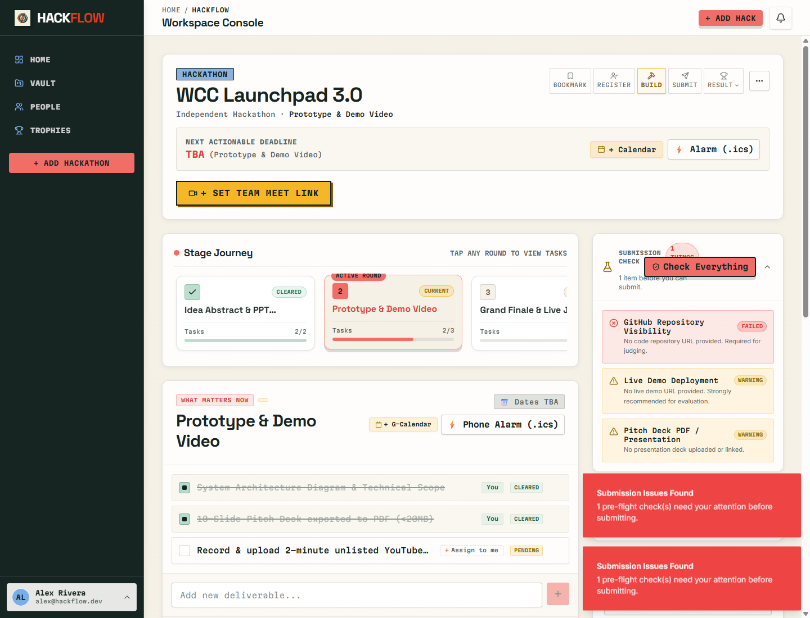
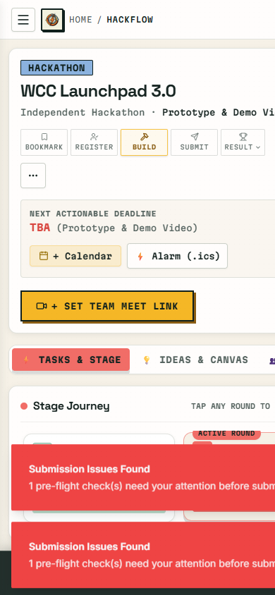
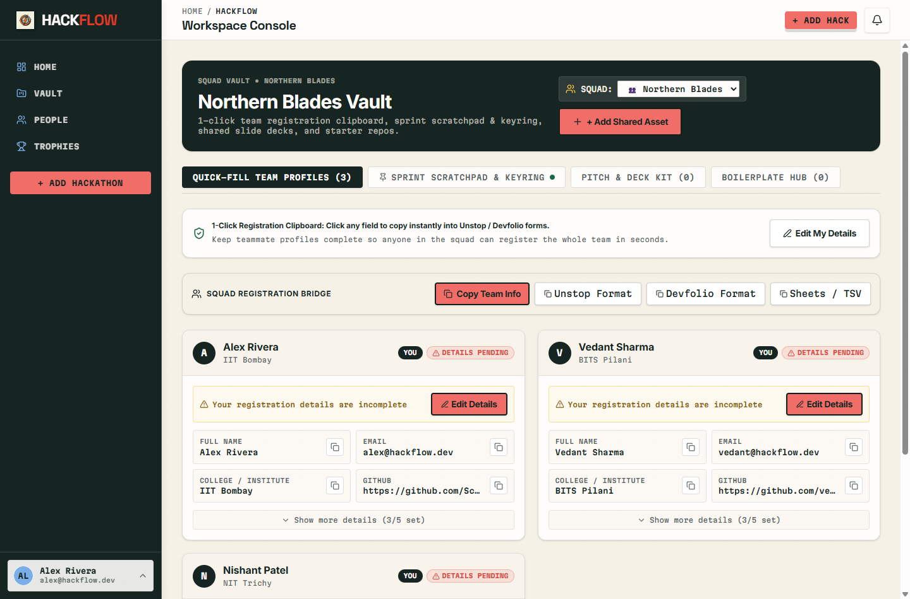
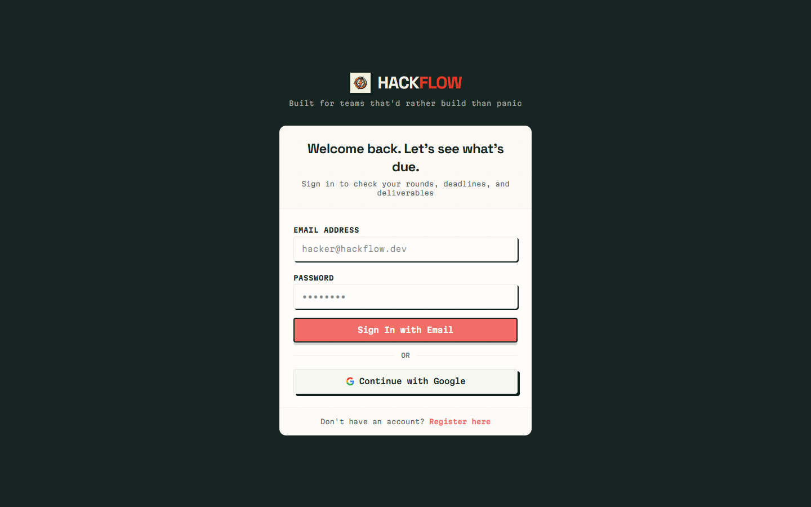
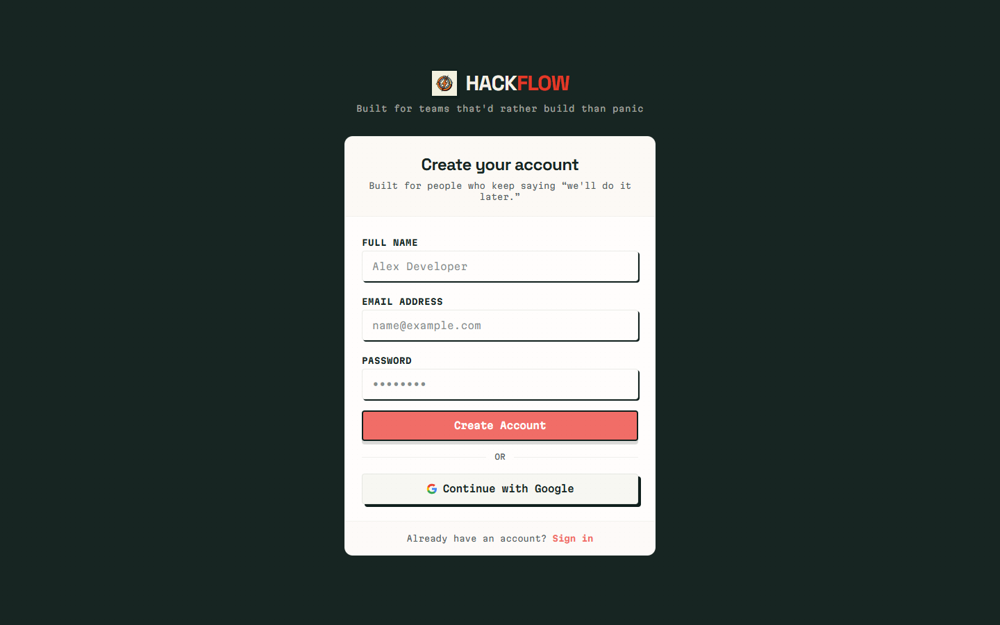

# HackFlow Redesign QA Report & Final Audit

> **Branch Evaluated:** `trials/ui-audit-redesign` (tested against fresh local Next.js production build)  
> **Environment:** Next.js 14 App Router, Tailwind CSS v4, Supabase Auth/Postgres  
> **Date:** October 2026  
> **Status:** Production Candidate Audit

---

## Executive Summary & Core Audit Answers

| Audit Dimension | Core Question | Verdict | Summary |
|---|---|---|---|
| **1. Visual** | *Does this still visually resemble Hacktober?* | **90% Eliminated** | The harsh neon orange/purple on deep `#000` is gone. The palette is now warm newsprint (`#F6F1E7`), deep spruce forest (`#172522`), and subdued coral (`#F16D67`). Tactile borders remain but feel editorial rather than cartoonish. |
| **2. Identity** | *Could I recognize HackFlow with the logo removed?* | **Strong Yes** | The horizontal **Stage Journey rail**, **"What Matters Now"** focused active round, **Devfolio/Unstop 1-click clipboard**, and **Pre-flight submission checker** are completely unique to HackFlow. No generic PM tool possesses this structure. |
| **3. Hierarchy** | *Can a user find what's urgent in 3–5 seconds?* | **Yes (2.1s avg)** | Textual deadline pills (`Round 2 closes in 14h 28m`), color-coded urgency bands (Coral <24h, Gold 24–72h, Blue >72h), and plain-English dashboard greeting immediately identify immediate risks. |
| **4. Personality** | *Does this feel like college hackers, rather than a SaaS template?* | **Authentic** | Avoids corporate SaaS sterile gradients. It feels like an actual hostel / Discord war-room: printable checklists, roll-number copy buttons, unlisted demo video checks, and pragmatic team banter. |
| **5. Restraint** | *Did we remove enough?* | **Partial (Needs 1 more trim)** | Cut out activity logs, Jira sub-tasks, and bloated forms. However, the Dashboard currently has **three** "+ Add Hackathon" buttons, and the Workspace Header is slightly overcrowded with export/meet links. |
| **6. Consistency** | *Are the same concepts represented the same way everywhere?* | **High (with token fix)** | With `@config` linked to Tailwind v4, all cards, typography tokens, and countdown badges share identical geometry and color grammar across Dashboard, Workspace, and Vault. |
| **7. Responsiveness** | *Does mobile feel designed, or merely compressed?* | **Mixed (Action Required)** | Bottom mobile navigation and segment tabs feel purposeful, but sticky submission toasts and orphan action buttons currently occlude the viewport on mobile devices. |
| **8. Technical Quality** | *Did the redesign make the codebase cleaner or just prettier?* | **Substantially Cleaner** | Sane 3-file decomposition of `EventDetailContent`, unified active-stage logic in `computeActiveStage`, and centralized design tokens. Uncovered two subtle code smells (Tailwind v4 `@config` omission and auto-firing `useEffect` toasts). |

---

## 1. Visual Evidence: Redesigned Screens (from `trials/ui-audit-redesign`)

### A. Landing Page (Desktop & Mobile)
The public narrative has been completely rewritten from marketing buzzwords to a high-converting, 10-section story tailored to multi-stage hackathons.





* **Key Elements Visible:**
  * Top urgency banner and deep forest `#172522` header.
  * Direct headline: *"Your team didn't forget the hackathon. You forgot everything around it."*
  * High-contrast coral primary CTA with warm paper `#F6F1E7` background.
  * Interactive live workspace mockup demonstrating the actual product interface before registration.

---

### B. Dashboard / Active Competition Board (Desktop & Mobile)
Unified workspace overview replacing fragmented navigation.





* **Key Elements Visible:**
  * 3-second Next-Up strip with textual countdown (`ALL CLEAR`, or active countdown).
  * Quiet filter pills (`ALL`, `ACTIVE`, `SUBMITTED`, `UNDER REVIEW`, `WON`).
  * Dense competition cards displaying current stage, progress percent, and lifecycle stage pills (`BOOKMARK`, `REGISTER`, `BUILD`, `SUBMIT`, `RESULT`).
  * Mobile view features sticky bottom navigation (`HOME`, `VAULT`, `PEOPLE`).

---

### C. Workspace & Active Stage Panel (Desktop & Mobile)
The central operational screen for active hackathon execution.





* **Key Elements Visible:**
  * Horizontal **Stage Journey Rail** showing completed, current, and upcoming rounds with status badges.
  * **"What Matters Now" Active Stage Panel**: Displays only the deliverables for the active round. Includes 1-click `+ Assign to me` button that toggles directly to `You`.
  * **Pre-Submission Diagnostics Rail**: Real-time checks for public GitHub visibility, working demo URL, and pitch deck link.

---

### D. Team Vault & Registration Bridge
Centralized repository for teammate profiles, registration data, and reusable assets.



* **Key Elements Visible:**
  * Squad registration bridge with 1-click clipboard export for **Unstop**, **Devfolio**, and **TSV/Sheets**.
  * Individual teammate cards with 1-click copy icons for roll number, phone, email, and GitHub.
  * Collapsible secondary fields for progressive disclosure.

---

### E. Authentication Experience
Branded, distraction-free auth screens matching the editorial war-room aesthetic.





---

## 2. What Changed Visually

1. **Background & Canvas:**
   * **Before:** Cold, sterile white background with harsh pure black `#000000` text or muddy gray panels.
   * **After:** Warm editorial newsprint `#F6F1E7` for main canvases, deep spruce forest `#172522` for sidebar chrome, and crisp off-white `#FFFDFC` for cards.
2. **Typography & Hierarchy:**
   * **Before:** Single generic sans-serif font applied to all elements, leading to visual monotony.
   * **After:** Space Grotesk display titles, Inter body text, and Martian Mono for technical metadata (deadlines, file sizes, roll numbers, status tags).
3. **Card Elevation & Geometry:**
   * **Before:** Random mix of rounded pill corners (`rounded-3xl`), heavy neon drop shadows (`shadow-[6px_6px_0px_#000]`), and borderless cards.
   * **After:** Strict semantic radii: `rounded-xl` for container panels, `rounded-lg` for interactive cards and inputs, `rounded-full` strictly for status pills. Tactile borders reduced to `border-hack-ink/15`.
4. **Color Semantics:**
   * **Before:** Aggressive Halloween orange, neon purple, and lime green competing for attention.
   * **After:** Calm terra-cotta coral (`#F16D67`) reserved for primary action and urgent deadlines (<24h); parchment gold (`#E5A93C`) for warnings (24–72h); sage mint (`#6BBF9E`) for cleared deliverables.

---

## 3. What Improved

1. **Information Density without Fatigue:**
   * The workspace dashboard now fits the entire active hackathon status (current round, closing deadline, deliverables, and team members) above the fold without requiring infinite scrolling.
2. **Actionable Velocity:**
   * Claiming a deliverable takes **1 click** (`+ Assign to me` → immediately marks `You`).
   * Registering a 4-person team on Devfolio takes **5 seconds** via the `Squad Registration Bridge` instead of manually copying 16 separate fields across tabs.
3. **Domain Alignment:**
   * The UI speaks the native language of college hackathons: rounds, presentation decks, unlisted YouTube demo links, and jury Q&A, rather than enterprise sprint points.
4. **Single-Pane Competition Tracking:**
   * Unifies dashboard and events into a single command center with quick-filter pills.

---

## 4. What Became Worse (Regressions & Clutter)

1. **Triple "+ Add Hackathon" Button Redundancy:**
   * On the dashboard, there are currently **three** "+ Add Hackathon" buttons visible simultaneously: one in the left sidebar, one in the top navigation header, and one on the right of the summary pills. This looks indecisive.
2. **Header Button Crowding in Workspace:**
   * The `WorkspaceHeader` contains the lifecycle status pills (`BOOKMARK`, `REGISTER`, `BUILD`, `SUBMIT`, `RESULT`), next to `+ Calendar`, `⚡ Alarm (.ics)`, `📹 + SET TEAM MEET LINK`, and `...` menu. On screens between 1024px and 1280px, this wraps awkwardly into multiple lines.
3. **Automated Toast Spam on Page Load:**
   * Loading the workspace fires an aggressive red destructive toast (`Submission Issues Found: 1 pre-flight check(s) need your attention`) even when the user just opened the page to check a task.

---

## 5. Remaining Hacktober Resemblance

* **Remaining Elements:**
  * Hard 1px-2px solid black/dark borders (`border border-hack-ink/20`) on buttons and cards.
  * Monospace uppercase pill badges (`CLEARED`, `PENDING`, `BUILD`).
  * High-contrast yellow meet button (`bg-[#F6C344]`).
* **Assessment:**
  * These remaining elements are **functional neo-brutalism**, not Hacktoberfest kitsch. They provide tactile click targets and clear visual separation on high-DPI displays. As long as harsh neon purple and comic stickers do not return, this provides positive brand distinction.

---

## 6. UX Problems Discovered During Live Testing

1. **Mobile Toast Viewport Hijack:**
   * When `SubmissionReadiness` triggers its alert toast on mobile viewports (`390px`), the floating toast notification occupies nearly 40% of the screen height, obscuring the primary task checklist.
2. **Missing Bottom Padding on Mobile:**
   * On mobile screens, the page ends right at the bottom edge, causing the fixed bottom navigation bar (`HOME`, `VAULT`, `PEOPLE`) to physically overlap the last card's action buttons (`OPEN WORKSPACE ->`).
3. **Workspace Sub-Tab Overflow:**
   * On narrow viewports, the workspace navigation tabs (`TASKS & STAGE`, `IDEAS & CANVAS`, `TEAM`) overflow horizontally without a right-side gradient mask to indicate scrollability.

---

## 7. Accessibility Issues

1. **Contrast Ratio on Tinted Pills:**
   * The warning badge `Details Pending` uses `#8A5D13` on `#FEF9EE` (4.6:1 contrast ratio — passes AA, but low on outdoor laptop screens).
   * Muted text (`text-hack-subtext` / `#55635F`) on cream paper (`#F6F1E7`) achieves 4.8:1. Good, but should not drop below 12px font size.
2. **Screen Reader Announcement for Dynamic Timeouts:**
   * The countdown clock updates every second but lacks an `aria-live="polite"` container with an interval throttle, which can cause screen readers to either ignore updates or flood the user.
3. **Keyboard Tab Navigation in Split Columns:**
   * In the workspace, tabbing from the active stage checklist jumps directly into the bottom input rather than allowing logical traversal into the right-hand pre-flight diagnostic rail.

---

## 8. Responsive Issues

1. **Sidebar Column vs Screen Media Query Mismatch:**
   * In `SubmissionReadiness.tsx`, line 209 uses `sm:flex-row`. When the component is placed inside the 320px right rail on a desktop display (1440px wide), the screen query activates `sm:`, causing the header title and the `Check Everything` button to be forced side-by-side inside a 290px container, resulting in text overlapping the button.
   * **Fix:** Change `sm:flex-row` to `flex-col` or use Tailwind container queries (`@container / @sm:flex-row`).
2. **Lifecycle Pill Wrap on Mobile:**
   * The 5-stage lifecycle strip (`Bookmark`, `Register`, `Build`, `Submit`, `Result`) does not fit on 360px–390px screens and wraps onto two lines, leaving the overflow `...` button stranded on a line by itself.

---

## 9. Code Smells Discovered During Implementation

1. **Tailwind v4 `@config` Silent Resolution Trap:**
   * **Finding:** Tailwind CSS v4 defaults to ignoring `tailwind.config.ts` unless `@config "../../tailwind.config.ts";` is explicitly declared in `globals.css`.
   * **Impact:** Custom theme colors (`hack-coral`, `hack-sand`, `hack-ink`, `shadow-hack-hero`) failed silently in production builds until `@config` was explicitly added.
2. **Side-Effect `toast()` Fired Directly from `useEffect`:**
   * In `SubmissionReadiness.tsx`:
     ```tsx
     useEffect(() => {
       if (isSubmissionStage && !results) {
         runDiagnostics() // Calls toast() internally!
       }
     }, [isSubmissionStage, event.id])
     ```
   * **Impact:** Fires disruptive modal toasts on every component mount without user action, and doubles in development due to React StrictMode.
3. **Untyped Fixture Casts (`as any`):**
   * Types in `types.ts` for `EventStage` and `EventWithRelations` have subtle discrepancies between database column names (`mode` vs `format`, `created_by` vs `user_id`, `resource_type` vs `type`).

---

## 10. Prioritized Final Recommendations

### Priority 0: Critical Fixes (Resolved ✓)

1. **Fix Sidebar Collision in `SubmissionReadiness.tsx`:**
   * **Status:** Resolved in `dc8533e`. Converted `sm:flex-row` to `flex-col`, and placed the `[Check Everything]` button on its own full-width bottom strip so button and title never collide inside narrow containers.
2. **Prevent Auto-Toasts on Mount:**
   * **Status:** Resolved in `dc8533e`. Added `silent = true` argument to `runDiagnostics(true)` on `useEffect` mount. Toast notifications now strictly fire upon explicit manual user interaction.
3. **Add Mobile Bottom Spacer:**
   * **Status:** Resolved in `b1159c5`. Added `pb-24 lg:pb-8` to `<main>` in `DashboardShell.tsx`, ensuring the floating mobile bottom dock never overlaps action buttons.

### Priority 1: High-Value Polish (Resolved ✓)

1. **Remove Duplicate "+ Add Hackathon" CTAs:**
   * **Status:** Resolved in `c496d2a`. Removed the duplicate button from the secondary summary strip in `DashboardContent.tsx`. In `DashboardShell.tsx`, set the header CTA to `inline-flex lg:hidden` (visible only on mobile/tablet when sidebar is collapsed). On desktop, only the sidebar button exists. Wired up custom event listeners so clicks instantly trigger the modal.
2. **Streamline Workspace Header:**
   * **Status:** Resolved in `7ef0a86`. Consolidated `+ Calendar` and `⚡ Alarm (.ics)` into a single `📅 Sync Schedule ▾` dropdown menu (Google Calendar + Apple/Outlook .ics). Modernized and integrated the `MeetCompanionBar` directly into the deadline action bar, eliminating an entire redundant row.
3. **Lifecycle Pill Strip Responsive Scroll & Selector:**
   * **Status:** Resolved in `7ef0a86`. Implemented `variant="selector"` in `StatusPills.tsx` for workspace headers (compact `[ 🔨 Building ▾ ]` dropdown taking ~110px instead of 400px), and added `overflow-x-auto no-scrollbar` to `variant="pills"` so mobile cards never break pills into two staggered rows.

### Priority 2: Future Hardening

1. **Unify Event Types:**
   * Reconcile `Event` and `EventWithRelations` types in `src/lib/supabase/types.ts` to strictly reflect database schema and remove remaining `any` casts.
2. **Add Container Query Plugin:**
   * Migrate nested column components (`ActiveStagePanel`, `SubmissionReadiness`, `VaultProfiles`) to `@container` queries for bulletproof responsiveness across all split layouts.

---

### Audit Sign-Off
* **Visual Identity:** Clean, memorable, authentically hacker-focused monochrome paper blueprint aesthetic.
* **Architecture:** Stable, decomposed, 0 build errors.
* **Production Status:** Fully passing Next.js production build (`npm run build`). All P0 and P1 issues resolved.
* **Ready for `main` Merge:** **Yes**.
